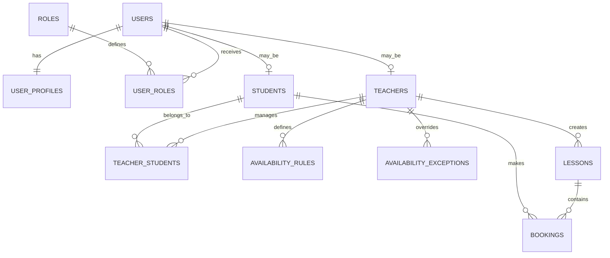

# Tennis Platform — Modelo de datos PostgreSQL

## 1. Principios

- PostgreSQL es la fuente transaccional.
- UUID como identificadores públicos.
- `timestamptz` para instantes.
- Zona horaria IANA para reglas y visualización.
- Liquibase como única herramienta de migraciones.
- Constraints de base de datos para invariantes críticas.
- Las entidades JPA no son entidades de dominio.

## 2. Entidades y decisiones

### User

Cuenta de autenticación. Contiene email, hash, estado y verificación.

### Role

Catálogo de `ADMIN`, `TEACHER` y `STUDENT`. Se relaciona con User mediante `user_roles`. El MVP limita a un rol por usuario.

### UserProfile

Separa datos personales de la autenticación: nombre, teléfono, DNI, dirección y zona horaria.

### Teacher

Perfil del profesor. Aunque existe uno en el MVP, se mantiene entidad propia.

### Student

Perfil operativo del alumno.

### TeacherStudent

Relación de gestión. Un alumno registrado no puede reservar hasta tener relación activa con el profesor.

### AvailabilityRule

Regla semanal recurrente.

### AvailabilityException

Bloqueo o disponibilidad extraordinaria para una fecha.

### Lesson

Evento concreto del calendario. Puede ser individual o grupal.

### Booking

Plaza de un alumno en una clase. Una clase puede tener muchas reservas.

### PlatformConfiguration

Configuración global, como límite de alumnos, ventana de cancelación e intervalo de 30 minutos.

## 3. Relaciones

| Relación | Cardinalidad |
|---|---|
| User - UserProfile | 1:1 |
| User - Role | N:M técnico, 1 rol en MVP |
| User - Teacher | 1:0..1 |
| User - Student | 1:0..1 |
| Teacher - Student | N:M mediante TeacherStudent |
| Teacher - AvailabilityRule | 1:N |
| Teacher - AvailabilityException | 1:N |
| Teacher - Lesson | 1:N |
| Lesson - Booking | 1:N |
| Student - Booking | 1:N |

## 4. Tablas principales

### users

- `id uuid PK`
- `email citext NOT NULL UNIQUE`
- `password_hash text NOT NULL`
- `status varchar(32) NOT NULL`
- `email_verified_at timestamptz NULL`
- `created_at timestamptz NOT NULL`
- `updated_at timestamptz NOT NULL`

Estados: `PENDING_EMAIL_VERIFICATION`, `ACTIVE`, `DEACTIVATED`.

### roles

- `code varchar(32) PK`
- `description text NOT NULL`
- `created_at timestamptz NOT NULL`

### user_roles

- `user_id uuid FK users`
- `role_code varchar(32) FK roles`
- `assigned_at timestamptz NOT NULL`
- PK compuesta `(user_id, role_code)`
- Índice único sobre `user_id` durante el MVP.

### user_profiles

- `user_id uuid PK/FK users`
- `first_name varchar(100) NOT NULL`
- `last_name varchar(150) NOT NULL`
- `phone varchar(30) NOT NULL`
- `national_id varchar(32) NOT NULL UNIQUE`
- `address_line varchar(255) NOT NULL`
- `postal_code varchar(20) NOT NULL`
- `city varchar(100) NOT NULL`
- `country varchar(100) NOT NULL`
- `timezone varchar(64) NOT NULL`
- Timestamps de creación y modificación.

### teachers

- `id uuid PK`
- `user_id uuid UNIQUE/FK users`
- `status varchar(32) NOT NULL`
- `is_primary boolean NOT NULL`
- Timestamps.

### students

- `id uuid PK`
- `user_id uuid UNIQUE/FK users`
- `status varchar(32) NOT NULL`
- Timestamps.

### teacher_students

- `teacher_id uuid FK teachers`
- `student_id uuid FK students`
- `status varchar(32) NOT NULL`
- `managed_at timestamptz NOT NULL`
- `managed_by uuid FK users`
- `deactivated_at timestamptz NULL`
- PK compuesta `(teacher_id, student_id)`.

### availability_rules

- `id uuid PK`
- `teacher_id uuid FK teachers`
- `day_of_week smallint NOT NULL`
- `start_minute smallint NOT NULL`
- `end_minute smallint NOT NULL`
- `valid_from date NOT NULL`
- `valid_until date NULL`
- `active boolean NOT NULL`
- `created_by uuid FK users`
- Timestamps.

La hora se representa como minutos desde medianoche. Por ejemplo, 09:00 son 540 minutos.

### availability_exceptions

- `id uuid PK`
- `teacher_id uuid FK teachers`
- `exception_date date NOT NULL`
- `start_minute smallint NOT NULL`
- `end_minute smallint NOT NULL`
- `exception_type varchar(32) NOT NULL`
- `reason varchar(255) NULL`
- `created_by uuid FK users`
- `created_at timestamptz NOT NULL`

Tipos: `BLOCKED`, `ADDITIONAL_AVAILABILITY`.

### lessons

- `id uuid PK`
- `teacher_id uuid FK teachers`
- `lesson_type varchar(32) NOT NULL`
- `starts_at timestamptz NOT NULL`
- `ends_at timestamptz NOT NULL`
- `schedule_timezone varchar(64) NOT NULL`
- `capacity smallint NOT NULL`
- `status varchar(32) NOT NULL`
- `availability_override boolean NOT NULL`
- `override_reason varchar(255) NULL`
- `notes text NULL`
- `created_by uuid FK users`
- `cancelled_by uuid FK users NULL`
- `cancelled_at timestamptz NULL`
- `version bigint NOT NULL`
- Timestamps.

Tipos: `INDIVIDUAL`, `GROUP`.

Estados persistidos: `OPEN`, `CANCELLED`, `COMPLETED`.

`FULL` se calcula cuando las reservas confirmadas alcanzan la capacidad.

### bookings

- `id uuid PK`
- `lesson_id uuid FK lessons`
- `student_id uuid FK students`
- `status varchar(32) NOT NULL`
- `attendance_status varchar(32) NULL`
- `booked_at timestamptz NOT NULL`
- `cancelled_at timestamptz NULL`
- `cancelled_by uuid FK users NULL`
- `cancellation_reason varchar(255) NULL`
- Timestamps.

Estados de reserva: `CONFIRMED`, `CANCELLED_BY_STUDENT`, `CANCELLED_BY_TEACHER`.

Estados de asistencia: `PENDING`, `ATTENDED`, `NO_SHOW`.

## 5. Integridad y concurrencia

### Evitar doble reserva

Índice único parcial:

```text
UNIQUE(lesson_id, student_id) WHERE status = CONFIRMED
```

Además, la aplicación bloqueará la fila de la clase durante la transacción.

### Evitar superar capacidad

La reserva debe:

1. Bloquear la clase.
2. Contar reservas confirmadas.
3. Comparar con capacidad.
4. Insertar la reserva.

Una constraint simple no puede contar filas relacionadas, por lo que el locking transaccional es necesario.

### Evitar clases solapadas

Se utilizará una exclusion constraint de PostgreSQL sobre:

- Profesor.
- Rango `tstzrange(starts_at, ends_at, '[)')`.

Las clases canceladas no participan en la restricción.

### Evitar solapamientos del alumno

Restricción de exclusión sobre una copia de los instantes de la clase en la reserva: la
aplicación comprueba antes para responder un 409 con sentido, y la base garantiza. Es el mismo
esquema de doble comprobación que el solapamiento de clases del profesor.

## 6. Timestamps y zonas horarias

- Instantes: `timestamptz`.
- Reglas recurrentes: minutos locales y día de semana.
- Excepciones: `date` y minutos locales en la zona del profesor.
- Zona de planificación almacenada en `schedule_timezone`.
- La interfaz convierte a la zona local del usuario.

No se utilizará `time with time zone`.

## 7. Índices principales

- `users(email)` unique.
- `users(status)`.
- `user_profiles(national_id)` unique.
- `teacher_students(student_id, status)`.
- `availability_rules(teacher_id, day_of_week, active)`.
- `availability_exceptions(teacher_id, exception_date)`.
- `lessons(teacher_id, starts_at)`.
- `lessons(status, starts_at)`.
- `bookings(lesson_id, status)`.
- `bookings(student_id, status)`.
- Tokens por hash y expiración.

## 8. Auditoría

No habrá tabla de auditoría formal en el MVP.

Se conservarán campos mínimos:

- `created_at`.
- `updated_at`.
- `created_by`.
- `cancelled_by`.
- `cancelled_at`.
- `managed_at`.
- `deactivated_at`.

Una futura tabla `audit_events` podrá ser append-only y almacenar acción, usuario, entidad, identificador y datos de cambio.

## 9. Liquibase

Changelogs recomendados:

1. Extensiones PostgreSQL.
2. Roles y usuarios.
3. Perfiles.
4. Profesores y alumnos.
5. Disponibilidad.
6. Clases.
7. Reservas.
8. Configuración.
9. Índices y constraints.

Los changesets ejecutados no se modifican; las correcciones se hacen con nuevos changesets.

## 10. Diagrama ER



## 11. Datos de prueba

Los tests utilizarán PostgreSQL real mediante Testcontainers y ejecutarán Liquibase desde una base vacía.

Fixtures mínimos:

- Admin.
- Profesor.
- Alumnos gestionados y no gestionados.
- Clases individuales y grupales.
- Clase llena.
- Reservas confirmadas y canceladas.
- Disponibilidad y bloqueos.
- Fechas de cambio horario.

Los datos de desarrollo serán sintéticos y nunca se usarán datos personales reales.
